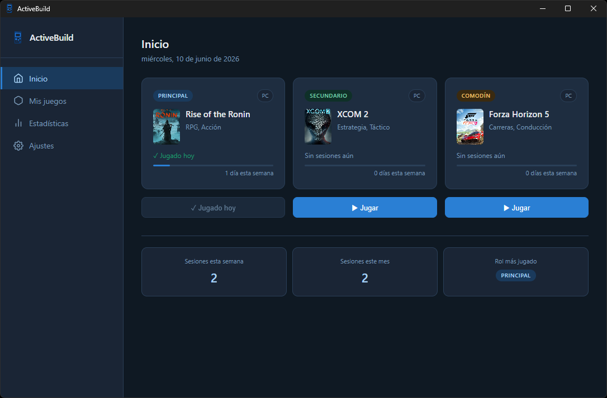
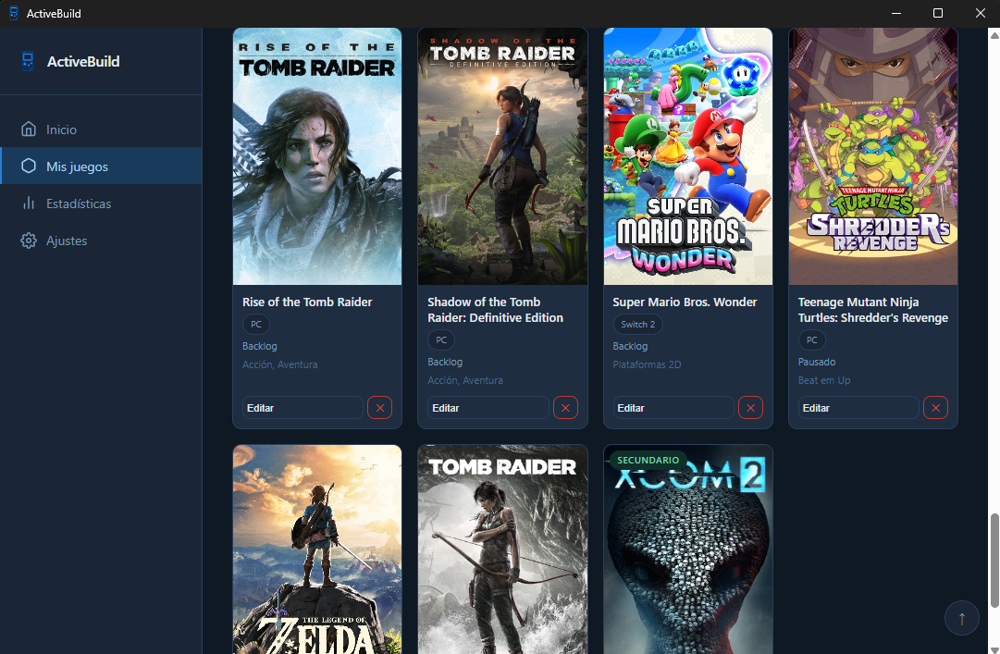
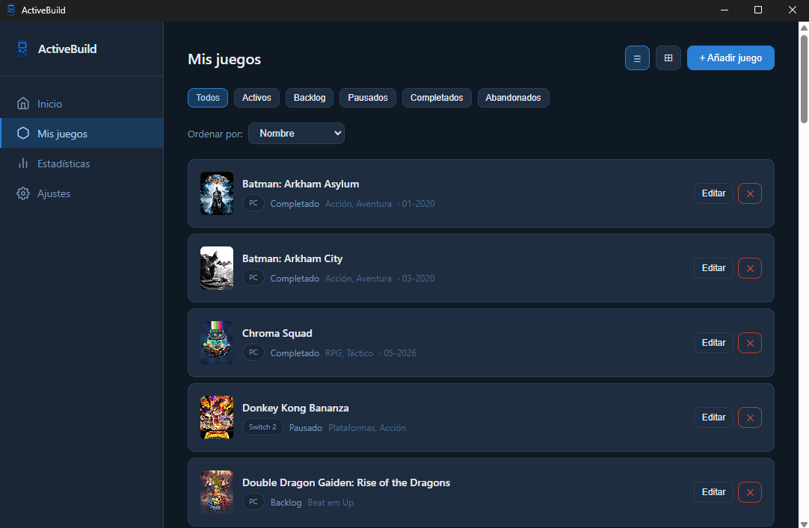
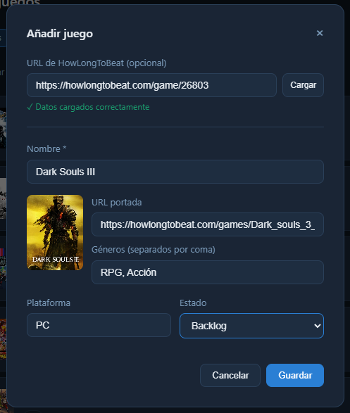
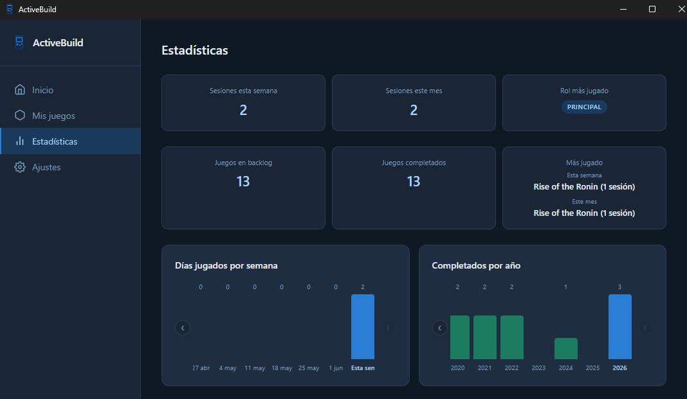
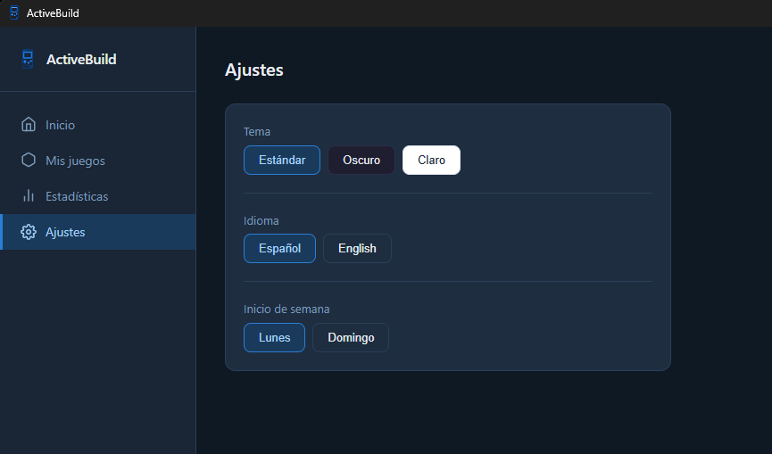

# ActiveBuild

> Organizador de backlog de videojuegos para Windows · Python · Flask · PyWebView · HTML/CSS/JS

ActiveBuild es una aplicación de escritorio diseñada para **reducir la parálisis de decisión** que provoca tener un backlog grande. En lugar de mostrar toda tu biblioteca de golpe, el sistema te obliga a mantener solo **tres juegos activos simultáneamente**, cada uno con un rol definido:

| Rol | Descripción |
|-----|-------------|
| 🔵 **Principal** | El juego al que dedicas la mayor parte del tiempo |
| 🟢 **Secundario** | Para cuando el principal se hace pesado |
| 🟠 **Comodín** | Sesiones cortas, para picar un rato sin comprometerse |

---

## Capturas de pantalla

| Inicio - juegos activos y estadísticas rápidas | Mis juegos - vista en cuadrícula |
|---|---|
|  |  |

| Mis juegos - vista en lista con filtros | Añadir juego con integración HLTB |
|---|---|
|  |  |

| Estadísticas con gráficas | Ajustes - tema, idioma y semana |
|---|---|
|  |  |

---

## ✨ Funcionalidades

**Pantalla de inicio**
- Tres tarjetas con los juegos activos (Principal, Secundario, Comodín), cada una con portada, plataforma, géneros, sesiones esta semana y última sesión
- Botón *Jugar* para registrar una sesión con un clic
- Mini-dashboard con sesiones semanales y mensuales y rol más jugado

**Mis juegos**
- Catálogo completo con vistas intercambiables en **cuadrícula** (portadas grandes) y **lista** (detalles completos)
- Filtros por estado: Todos · Activos · Backlog · Pausados · Completados · Abandonados
- Ordenación por nombre, plataforma o estado
- CRUD completo: añadir, editar y eliminar juegos

**Añadir / editar juego - integración con HowLongToBeat**
- Pega la URL de cualquier juego de HLTB y la app carga automáticamente el **nombre** y la **URL de portada**
- Campos manuales: plataforma, género(s) y estado
- Al marcar un juego como completado, aparece un selector de **mes y año de finalización**

**Estadísticas**
- Tarjetas de resumen: sesiones semanales/mensuales, juegos en backlog, juegos completados, más jugado esta semana y este mes
- Gráfico de barras de **días jugados por semana** (desplazable por semanas)
- Gráfico de barras de **juegos completados por año**

**Ajustes**
- **Tema**: Estándar (azul oscuro) · Oscuro · Claro
- **Idioma**: Español · English
- **Inicio de semana**: Lunes · Domingo

---

## Arquitectura

ActiveBuild usa **Flask como servidor local** y **PyWebView** para mostrar la app en una ventana nativa de Windows. No abre el navegador del sistema.

```
ActiveBuild.exe  (doble clic para abrir)
    └─► PyWebView → abre ventana nativa con motor Edge embebido
            └─► Flask (localhost) → sirve las páginas y la API REST
                    └─► HTML/CSS/JS (frontend)
                            └─► fetch() → endpoints Flask → JSON (datos)
```

**Al cerrar la ventana, todo el proceso termina** - no queda nada en segundo plano ni en la bandeja del sistema.

---

## Tecnologías

| Tecnología | Uso |
|-----------|-----|
| **Python** | Lenguaje principal |
| **Flask** | Servidor web local y API REST |
| **PyWebView** | Ventana nativa de escritorio con motor Edge |
| **HTML · CSS · JS** | Frontend completo de la app |
| **JSON** | Almacenamiento portátil (sin dependencia de BD) |
| **howlongtobeatpy** | Scraping de datos de HowLongToBeat |

---

## Conceptos técnicos aplicados

- **API REST local** con Flask: rutas separadas por recurso (`/api/games`, `/api/sessions`, `/api/stats`, `/api/settings`), verbos HTTP correctos y respuestas JSON
- **Sistema i18n propio** en `i18n.js`: función `t()` para traducir por clave y atributos `data-i18n` en el HTML para cambio de idioma sin recargar la página
- **Cambio de tema sin flash**: el tema se guarda en `localStorage` y se aplica antes del primer render, evitando el parpadeo entre navegaciones
- **Integración con API externa**: uso de `howlongtobeatpy` para obtener nombre y portada de los juegos a partir de su URL en HowLongToBeat
- **Modelo de datos con UUIDs**: cada juego tiene un `id` UUID propio, independiente del `hltb_id`, permitiendo registrar juegos sin URL de HLTB
- **Script de migración**: al añadir el campo `completed_date` a mitad del desarrollo, se escribió un script de migración para actualizar los registros existentes sin perder datos

---

*Proyecto personal · Desarrollado con Python 3.12 · Windows 11*
